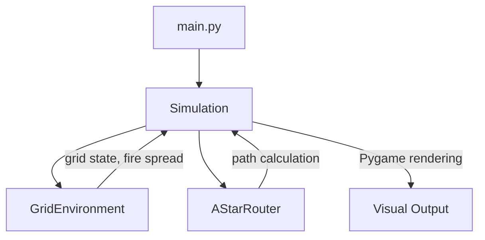

# Dynamic Wildfire Evacuation Router — Implementation Plan

## Problem Summary

Build a Python simulation of a dynamic pathfinding agent that calculates the safest/fastest escape route on a grid while wildfire spreads in real-time. The agent uses **A\* Search** (implemented from scratch) with dynamic replanning.

---

## Proposed Architecture



### File Structure

```
pai-proj/
├── main.py              # Entry point — instantiates and runs the Simulation
├── grid_environment.py  # GridEnvironment class (grid state, fire spread, rendering)
├── astar_router.py      # AStarRouter class (A* from scratch, heuristics, costs)
├── simulation.py        # Simulation class (main loop, agent movement, replanning)
├── config.py            # All tunable constants (grid size, fire rate, costs, colors)
├── report.md            # Project report content (Part 2 deliverable)
└── requirements.txt     # Dependencies (pygame, numpy)
```

---

## Proposed Changes

### Config Module

#### [NEW] [config.py](file:///c:/Users/cse/Documents/pai-proj/config.py)

Central constants file for all tunable parameters:

| Constant | Default | Purpose |
|---|---|---|
| `GRID_ROWS` / `GRID_COLS` | 40 | Grid dimensions |
| `CELL_SIZE` | 16 | Pixel size of each cell |
| `OBSTACLE_DENSITY` | 0.15 | Fraction of cells that are static obstacles |
| `FIRE_SEEDS` | 3 | Number of initial fire starting points |
| `FIRE_SPREAD_INTERVAL` | 2 | Fire expands every N agent steps |
| `FIRE_SPREAD_PROB` | 0.4 | Probability a neighbor cell catches fire |
| `HIGH_RISK_COST` | 50 | Movement cost for high-risk (fire-adjacent) cells |
| `CLEAR_COST` | 1 | Movement cost for a clear cell |
| `FPS` | 10 | Simulation frames per second |
| Color palette | — | Distinct colors for each cell state |

---

### Grid Environment

#### [NEW] [grid_environment.py](file:///c:/Users/cse/Documents/pai-proj/grid_environment.py)

**`class GridEnvironment`** — Manages the 2D grid state, fire simulation, and Pygame rendering.

**Key Methods:**

| Method | Responsibility |
|---|---|
| `__init__(rows, cols)` | Initialize grid with numpy, place obstacles, fire seeds, start/end |
| `generate_map()` | Procedurally place obstacles ensuring S→E connectivity (BFS check) |
| `spread_fire()` | Cellular automata: each fire cell ignites neighbors with probability P; update high-risk buffer |
| `update_high_risk_zones()` | Mark all clear cells adjacent to fire as state `3` (high-risk) |
| `get_neighbors(pos)` | Return walkable 4-directional neighbors |
| `get_cost(pos)` | Return movement cost based on cell state (1, 50, or ∞) |
| `is_passable(pos)` | Check if cell is not fire/obstacle |
| `draw(surface, path, agent_pos)` | Render the grid, path overlay, agent, start/end markers |

**Cell State Encoding:**
- `0` → Clear (white/light gray)
- `1` → Obstacle (dark gray)
- `2` → Fire (orange-red with glow effect)
- `3` → High-Risk (yellow-amber)

**Fire Spread Algorithm (Cellular Automata):**
```
for each cell where state == FIRE:
    for each 4-directional neighbor:
        if neighbor is CLEAR or HIGH_RISK:
            if random() < FIRE_SPREAD_PROB:
                set neighbor to FIRE
after spreading, recalculate all HIGH_RISK zones as 1-cell buffer around fire
```

**Map Generation:**
- Random obstacle placement at `OBSTACLE_DENSITY`
- Start placed at top-left quadrant, End at bottom-right quadrant
- Fire seeds placed in the middle band of the grid
- BFS validation to ensure a path S→E exists before fire starts

---

### A* Router

#### [NEW] [astar_router.py](file:///c:/Users/cse/Documents/pai-proj/astar_router.py)

**`class AStarRouter`** — Pure A\* implementation from scratch using a min-heap.

**Key Methods:**

| Method | Responsibility |
|---|---|
| `__init__(grid_env)` | Store reference to GridEnvironment for cost/neighbor queries |
| `heuristic(a, b)` | Manhattan distance: `|a.x - b.x| + |a.y - b.y|` |
| `find_path(start, goal)` | Full A\* with open set (heapq), closed set, g/f scores, parent tracking |
| `reconstruct_path(came_from, current)` | Backtrack from goal to start via parent pointers |

**A\* Implementation Details:**
- **Open set**: Python `heapq` priority queue storing `(f_score, counter, node)` — counter breaks ties for deterministic behavior
- **Closed set**: Python `set` for O(1) membership checks
- **g(n)**: Accumulated cost from start; uses `grid_env.get_cost(neighbor)` for edge weights
- **h(n)**: Manhattan distance to goal (admissible heuristic for 4-directional grid)
- **f(n)**: `g(n) + h(n)`
- Returns `None` if no path exists (agent is trapped)

> [!NOTE]
> No external pathfinding libraries used — `heapq` is a stdlib data structure, not a pathfinding library.

---

### Simulation Controller

#### [NEW] [simulation.py](file:///c:/Users/cse/Documents/pai-proj/simulation.py)

**`class Simulation`** — Main game loop orchestrating agent movement, fire spread, and replanning.

**Core Loop (per frame):**

```
1. Agent moves 1 step along current planned path
2. Increment step_counter
3. If step_counter % FIRE_SPREAD_INTERVAL == 0:
      → grid.spread_fire()
4. Check if remaining path intersects any FIRE or HIGH_RISK cells
5. If path is blocked OR path is None:
      → Trigger replan: router.find_path(agent_pos, goal)
      → Visual flash/indicator to show replanning occurred
6. If agent reaches goal → display SUCCESS
7. If no path exists → display TRAPPED / FAILURE
8. Render frame
```

**Visual Features:**
- Agent rendered as a colored circle/diamond
- Current path drawn as a dotted/colored line overlay
- When replanning occurs, briefly flash the screen or show a "REPLANNING" indicator
- Status panel at the bottom showing: step count, replan count, path length, current cost
- Legend showing what each color represents
- Fire cells rendered with a subtle animated glow (alternating shades)

**User Controls:**
- `SPACE` — pause/resume simulation
- `R` — restart with new random map
- `+`/`-` — speed up / slow down simulation
- `ESC` — quit

---

### Entry Point

#### [NEW] [main.py](file:///c:/Users/cse/Documents/pai-proj/main.py)

Simple entry point:
```python
if __name__ == "__main__":
    sim = Simulation()
    sim.run()
```

---

### Project Report

#### [NEW] [report.md](file:///c:/Users/cse/Documents/pai-proj/report.md)

**Part 2 deliverable** containing:

1. **g(n) and h(n) Balance Explanation** — How accumulated cost steers away from fire while heuristic guides toward the goal
2. **Time Complexity Analysis** — A\* is O(b^d) worst case; in dynamic replanning, amortized cost discussion; why D\* Lite exists but A\* replan is pedagogically clearer
3. **Intelligent Agents Framework** — PEAS analysis, environment properties (partially observable, stochastic, sequential, dynamic), how this fulfills AI curriculum requirements

---

### Dependencies

#### [NEW] [requirements.txt](file:///c:/Users/cse/Documents/pai-proj/requirements.txt)

```
pygame>=2.5.0
numpy>=1.24.0
```

---

## User Review Required

> [!IMPORTANT]
> **Visualization Choice**: I'm proposing **Pygame** over matplotlib's FuncAnimation. Pygame gives smoother real-time control, keyboard input handling, and better visual effects. matplotlib would work but feels sluggish for interactive simulations. **Is Pygame acceptable?**

> [!NOTE]
> **Grid Size**: I'm proposing a **40×40 grid** as a good balance between visual complexity and performance. 30×30 feels sparse; 50×50 can make cells too small. Happy to adjust.

## Verification Plan

### Automated Tests
- Run the simulation and verify the agent reaches the safe zone or correctly reports being trapped
- Validate A\* finds the optimal path on a static grid (compare with known shortest path)
- Verify fire spread correctly marks high-risk zones as 1-cell buffers

### Manual Verification
- Visual confirmation: fire spreads, path visibly shifts on replan, agent avoids fire
- Test edge cases: agent surrounded by fire (should report TRAPPED), fire between S and E
- Record a browser/screen walkthrough showing the simulation in action
