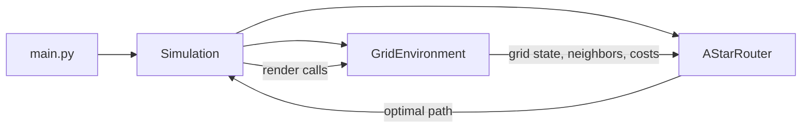
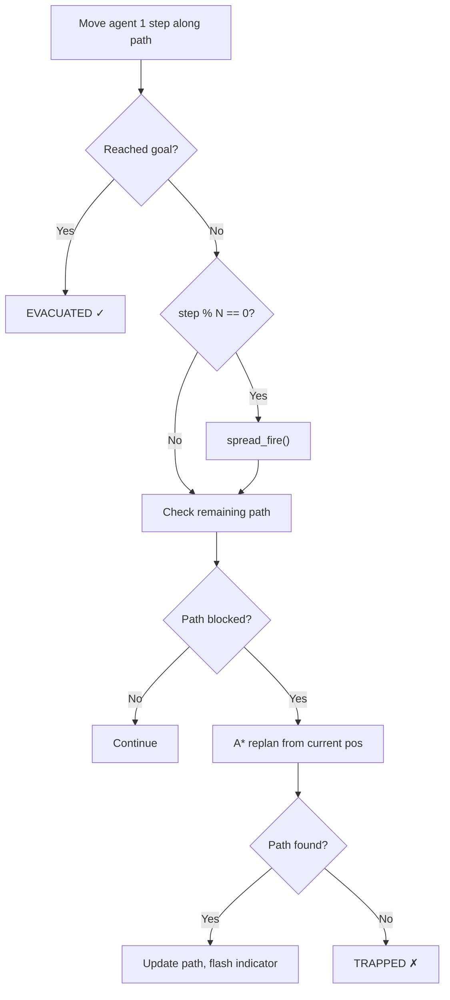

# Dynamic Wildfire Evacuation Router — Walkthrough

## What Was Built

A complete **Dynamic Wildfire Evacuation Router** simulation for the PAI capstone project. An intelligent agent uses **A\* Search** to find the safest escape route through a grid town while wildfire spreads in real-time. When fire blocks the planned path, the agent **dynamically replans**.

---

## File Structure

| File | Purpose |
|------|---------|
| [config.py](file:///c:/Users/cse/Documents/pai-proj/config.py) | All tunable constants (grid size, costs, fire mechanics, colors) |
| [grid_environment.py](file:///c:/Users/cse/Documents/pai-proj/grid_environment.py) | Grid state management, fire spread (cellular automata), Pygame rendering |
| [astar_router.py](file:///c:/Users/cse/Documents/pai-proj/astar_router.py) | A\* search from scratch (heapq, Manhattan heuristic, path reconstruction) |
| [simulation.py](file:///c:/Users/cse/Documents/pai-proj/simulation.py) | Main loop: agent movement, fire timing, path validation, replanning |
| [main.py](file:///c:/Users/cse/Documents/pai-proj/main.py) | Entry point — `python main.py` |
| [report.md](file:///c:/Users/cse/Documents/pai-proj/report.md) | Full project report (Part 2 deliverable) |
| [requirements.txt](file:///c:/Users/cse/Documents/pai-proj/requirements.txt) | Dependencies: pygame, numpy |

---

## Architecture



### Per-Frame Loop (in `Simulation._tick()`)



---

## Key Algorithms

### A\* Search ([astar_router.py:find_path](file:///c:/Users/cse/Documents/pai-proj/astar_router.py#L62-L123))
- **From scratch** using `heapq` — no external pathfinding libraries
- **g(n)**: Accumulated cost (1 for clear, 50 for high-risk, ∞ for fire/obstacle)
- **h(n)**: Manhattan distance (admissible for 4-directional grid)
- Tie-breaking counter for deterministic behavior

### Fire Spread ([grid_environment.py:spread_fire](file:///c:/Users/cse/Documents/pai-proj/grid_environment.py#L109-L135))
- Probabilistic cellular automaton (P = 0.4 per neighbor)
- 1-cell high-risk buffer recalculated after each spread

### Dynamic Replanning ([simulation.py:_check_and_replan](file:///c:/Users/cse/Documents/pai-proj/simulation.py#L126-L159))
- Scans remaining path for FIRE or HIGH_RISK cells
- Triggers full A\* replan from agent's current position if blocked

---

## Test Results

All 5 headless logic tests passed:

| Test | Result |
|------|--------|
| Initial A\* pathfinding | ✅ Path found (length=35 on 20×20 grid) |
| Fire spread mechanics | ✅ Fire grew from 3 → 30 cells after 3 spreads |
| High-risk zone buffer | ✅ 29 high-risk cells created around fire |
| Dynamic replanning | ✅ New path found after blocking original |
| Heuristic admissibility | ✅ Manhattan (0,0)→(19,19) = 38 |

Interactive Pygame simulation launched and ran without errors.

---

## How to Run

```bash
cd c:\Users\cse\Documents\pai-proj
pip install -r requirements.txt
python main.py
```

### Controls
| Key | Action |
|-----|--------|
| `SPACE` | Pause / Resume |
| `R` | Restart with new random map |
| `+` / `-` | Speed up / Slow down |
| `ESC` | Quit |

---

## Visual Features

- **Fire glow animation** — alternating orange-red shades
- **Replan flash** — path turns yellow for one frame when replanning occurs
- **End-state overlays** — "EVACUATED SAFELY!" (green) or "TRAPPED!" (red)
- **HUD panel** — step count, replan count, remaining path length, controls
- **Color-coded cells** — clear (off-white), obstacles (charcoal), fire (orange-red), high-risk (amber), path (blue), agent (cyan-teal)
